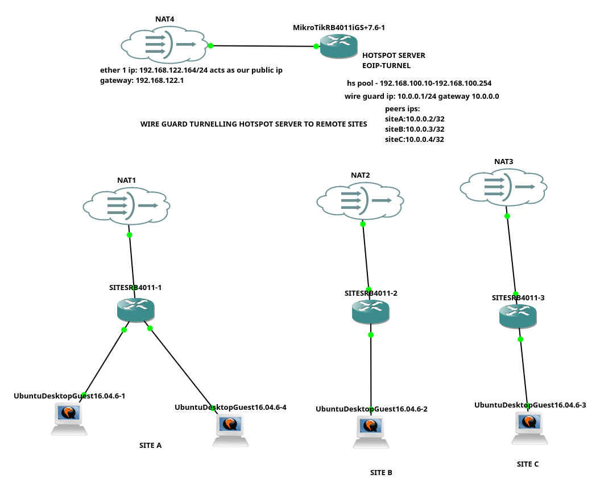

```

[admin@AGREGATOR_SWITCH] > export
# mar/24/2026 12:56:34 by RouterOS 7.6
# software id = 
#
/interface bridge
add fast-forward=no ingress-filtering=no name=OUT_BRIDGE vlan-filtering=yes
/interface ethernet
set [ find default-name=ether1 ] disable-running-check=no
set [ find default-name=ether2 ] disable-running-check=no
set [ find default-name=ether3 ] disable-running-check=no
set [ find default-name=ether4 ] disable-running-check=no speed=1Gbps
set [ find default-name=ether5 ] disable-running-check=no
set [ find default-name=ether6 ] disable-running-check=no
set [ find default-name=ether7 ] disable-running-check=no
set [ find default-name=ether8 ] disable-running-check=no
set [ find default-name=ether9 ] disable-running-check=no
set [ find default-name=ether10 ] disable-running-check=no
set [ find default-name=ether11 ] disable-running-check=no
set [ find default-name=ether12 ] disable-running-check=no
set [ find default-name=ether13 ] disable-running-check=no
set [ find default-name=ether14 ] disable-running-check=no
set [ find default-name=ether15 ] disable-running-check=no
set [ find default-name=ether16 ] disable-running-check=no
set [ find default-name=ether17 ] disable-running-check=no
set [ find default-name=ether18 ] disable-running-check=no
set [ find default-name=ether19 ] disable-running-check=no
set [ find default-name=ether20 ] disable-running-check=no
set [ find default-name=ether21 ] disable-running-check=no
set [ find default-name=ether22 ] disable-running-check=no
set [ find default-name=ether23 ] disable-running-check=no
set [ find default-name=ether24 ] disable-running-check=no
set [ find default-name=ether25 ] disable-running-check=no
set [ find default-name=ether26 ] disable-running-check=no
set [ find default-name=ether27 ] disable-running-check=no
set [ find default-name=ether28 ] disable-running-check=no
/interface vlan
add interface=OUT_BRIDGE name=VLAN10_HS vlan-id=10
add interface=OUT_BRIDGE name=VLAN20_PPPOE vlan-id=20
/interface bonding
add comment="BONDING UPLINKETHER1_2" mode=802.3ad name=bonding1 slaves=\
    ether1,ether2 transmit-hash-policy=layer-3-and-4
/interface wireless security-profiles
set [ find default=yes ] supplicant-identity=MikroTik
/port
set 0 name=serial0
/interface bridge port
add bridge=OUT_BRIDGE interface=ether3
add bridge=OUT_BRIDGE interface=ether4
add bridge=OUT_BRIDGE interface=ether5 pvid=20
/interface bridge vlan
add bridge=OUT_BRIDGE tagged=OUT_BRIDGE,ether4 vlan-ids=10
add bridge=OUT_BRIDGE tagged=OUT_BRIDGE,ether3 untagged=ether5 vlan-ids=20
/ip address
add address=102.0.6.133/30 comment=HS_STATIC_IP interface=VLAN10_HS network=\
    102.0.6.132
add address=102.203.85.5/28 comment=PPPOE_STATIC_IP interface=VLAN20_PPPOE \
    network=102.203.85.0
/ip dhcp-client
add interface=bonding1
/ip dns
set allow-remote-requests=yes servers=8.8.8.8
/ip firewall filter
add action=accept chain=forward
/ip firewall nat
add action=masquerade chain=srcnat out-interface=bonding1
/system identity
set name=AGREGATOR_SWITCH
/tool romon
set enabled=yes
[admin@AGREGATOR_SWITCH] > 
```
### setting the static ip to the server

# Set the IP address and Gateway
# We use .5 as the gateway because that is what you assigned to the MikroTik's VLAN20 interface
```
sudo nmcli con mod eth0 ipv4.addresses 102.203.85.7/28
sudo nmcli con mod eth0 ipv4.gateway 102.203.85.5
sudo nmcli con mod eth0 ipv4.dns "8.8.8.8,8.8.4.4"
sudo nmcli con mod eth0 ipv4.method manual
```
# Restart the interface
```
sudo nmcli con up eth0
```

```
[admin@PPPOE_GNS3] > export
# mar/24/2026 12:57:03 by RouterOS 7.6
# software id = 
#
/interface ethernet
set [ find default-name=ether1 ] disable-running-check=no
set [ find default-name=ether2 ] disable-running-check=no
set [ find default-name=ether3 ] disable-running-check=no
set [ find default-name=ether4 ] disable-running-check=no
set [ find default-name=ether5 ] disable-running-check=no
set [ find default-name=ether6 ] disable-running-check=no
set [ find default-name=ether7 ] disable-running-check=no
set [ find default-name=ether8 ] disable-running-check=no
set [ find default-name=ether9 ] disable-running-check=no
/interface vlan
add interface=ether1 name=PPPOE_VLAN_50 vlan-id=50
add interface=ether9 name=VLAN20_UPLINK vlan-id=20
/interface wireless security-profiles
set [ find default=yes ] supplicant-identity=MikroTik
/ip pool
add name=dhcp_pool0 ranges=172.16.0.2-172.16.255.254
/ip dhcp-server
add address-pool=dhcp_pool0 interface=PPPOE_VLAN_50 name=dhcp1
/port
set 0 name=serial0
/ppp profile
add dns-server=8.8.8.8,1.1.1.1 local-address=172.16.0.1 name=pppoe_profile \
    remote-address=dhcp_pool0
/interface pppoe-server server
add disabled=no interface=PPPOE_VLAN_50 service-name=pppoe_server
/ip address
add address=102.203.85.6/28 interface=VLAN20_UPLINK network=102.203.85.0
add address=172.16.0.1/16 interface=PPPOE_VLAN_50 network=172.16.0.0
/ip dhcp-server network
add address=172.16.0.0/16 gateway=172.16.0.1
/ip dns
set allow-remote-requests=yes servers=102.203.85.5
/ip firewall nat
add action=masquerade chain=srcnat out-interface=VLAN20_UPLINK
/ip route
add gateway=102.203.85.5
/ppp secret
add name=test1 profile=pppoe_profile
/system identity
set name=PPPOE_GNS3
/tool romon
set enabled=yes
[admin@PPPOE_GNS3] > 
```

```
[admin@HS_GNS3] > export
# mar/24/2026 12:57:27 by RouterOS 7.6
# software id = 
#
/interface ethernet
set [ find default-name=ether1 ] disable-running-check=no
set [ find default-name=ether2 ] disable-running-check=no
set [ find default-name=ether3 ] disable-running-check=no
set [ find default-name=ether4 ] disable-running-check=no
set [ find default-name=ether5 ] disable-running-check=no
set [ find default-name=ether6 ] disable-running-check=no
set [ find default-name=ether7 ] disable-running-check=no
set [ find default-name=ether8 ] disable-running-check=no
set [ find default-name=ether9 ] disable-running-check=no speed=1Gbps
/interface vlan
add interface=ether1 name=HS_VLAN100 vlan-id=100
add interface=ether9 name=VLAN10_UPLINK vlan-id=10
/interface wireless security-profiles
set [ find default=yes ] supplicant-identity=MikroTik
/ip hotspot profile
add dns-name=gns.test hotspot-address=10.0.0.1 name=hsprof1
/ip pool
add name=dhcp_pool0 ranges=172.16.0.2-172.16.255.254
add name=dhcp_pool1 ranges=10.0.0.2-10.0.255.254
/ip dhcp-server
add address-pool=dhcp_pool1 interface=HS_VLAN100 name=dhcp1
/ip hotspot
add address-pool=dhcp_pool1 disabled=no interface=HS_VLAN100 name=hotspot1 \
    profile=hsprof1
/port
set 0 name=serial0
/ip address
add address=102.0.6.134/30 interface=VLAN10_UPLINK network=102.0.6.132
add address=10.0.0.1/16 interface=HS_VLAN100 network=10.0.0.0
/ip dhcp-server network
add address=10.0.0.0/16 gateway=10.0.0.1
add address=172.16.0.0/16 gateway=172.16.0.1
/ip dns
set allow-remote-requests=yes servers=102.0.6.133
/ip firewall filter
add action=passthrough chain=unused-hs-chain comment=\
    "place hotspot rules here" disabled=yes
/ip firewall nat
add action=passthrough chain=unused-hs-chain comment=\
    "place hotspot rules here" disabled=yes
add action=masquerade chain=srcnat out-interface=VLAN10_UPLINK
add action=masquerade chain=srcnat comment="masquerade hotspot network" \
    src-address=10.0.0.0/16
/ip hotspot user
add name=admin
/ip route
add check-gateway=ping disabled=no distance=1 dst-address=0.0.0.0/0 gateway=\
    102.0.6.133 pref-src="" routing-table=main scope=30 suppress-hw-offload=no \
    target-scope=10
/system identity
set name=HS_GNS3
/tool romon
set enabled=yes
[admin@HS_GNS3] > 
```

```
[admin@SWITCH_GNS3] > export
# mar/24/2026 12:57:50 by RouterOS 7.6
# software id = 
#
/interface bridge
add name=bridge1-trunk vlan-filtering=yes
/interface ethernet
set [ find default-name=ether1 ] disable-running-check=no
set [ find default-name=ether2 ] disable-running-check=no
set [ find default-name=ether3 ] disable-running-check=no
set [ find default-name=ether4 ] disable-running-check=no
set [ find default-name=ether5 ] disable-running-check=no
set [ find default-name=ether6 ] disable-running-check=no
set [ find default-name=ether7 ] disable-running-check=no
set [ find default-name=ether8 ] disable-running-check=no
set [ find default-name=ether9 ] disable-running-check=no
set [ find default-name=ether10 ] disable-running-check=no
set [ find default-name=ether11 ] disable-running-check=no
set [ find default-name=ether12 ] disable-running-check=no
set [ find default-name=ether13 ] disable-running-check=no
set [ find default-name=ether14 ] disable-running-check=no
set [ find default-name=ether15 ] disable-running-check=no
set [ find default-name=ether16 ] disable-running-check=no
set [ find default-name=ether17 ] disable-running-check=no
set [ find default-name=ether18 ] disable-running-check=no
set [ find default-name=ether19 ] disable-running-check=no
set [ find default-name=ether20 ] disable-running-check=no
set [ find default-name=ether21 ] disable-running-check=no
set [ find default-name=ether22 ] disable-running-check=no
set [ find default-name=ether23 ] disable-running-check=no
set [ find default-name=ether24 ] disable-running-check=no
set [ find default-name=ether25 ] disable-running-check=no
set [ find default-name=ether26 ] disable-running-check=no
set [ find default-name=ether27 ] disable-running-check=no
set [ find default-name=ether28 ] disable-running-check=no
/interface wireless security-profiles
set [ find default=yes ] supplicant-identity=MikroTik
/port
set 0 name=serial0
/interface bridge port
add bridge=bridge1-trunk interface=ether1
add bridge=bridge1-trunk interface=ether5
add bridge=bridge1-trunk interface=ether6
/interface bridge vlan
add bridge=bridge1-trunk tagged=ether1,ether5,ether6 vlan-ids=50,100
/ip dhcp-client
# DHCP client can not run on slave or passthrough interface!
add interface=ether1
/system identity
set name=SWITCH_GNS3
/tool romon
set enabled=yes
[admin@SWITCH_GNS3] > 
```

```
[admin@ROUTING_ROUTER] > export
# mar/24/2026 12:58:14 by RouterOS 7.6
# software id = 
#
/interface bridge
add name=bridge-vlan vlan-filtering=yes
/interface ethernet
set [ find default-name=ether1 ] disable-running-check=no
set [ find default-name=ether2 ] disable-running-check=no
set [ find default-name=ether3 ] disable-running-check=no
set [ find default-name=ether4 ] disable-running-check=no
set [ find default-name=ether5 ] disable-running-check=no
set [ find default-name=ether6 ] disable-running-check=no
set [ find default-name=ether7 ] disable-running-check=no
set [ find default-name=ether8 ] disable-running-check=no
set [ find default-name=ether9 ] disable-running-check=no
/interface wireless security-profiles
set [ find default=yes ] supplicant-identity=MikroTik
/port
set 0 name=serial0
/interface bridge port
add bridge=bridge-vlan interface=ether1 pvid=50
add bridge=bridge-vlan interface=ether9
add bridge=bridge-vlan interface=ether2 pvid=100
/interface bridge vlan
add bridge=bridge-vlan tagged=ether9 vlan-ids=50
add bridge=bridge-vlan tagged=ether9 vlan-ids=100
/ip dhcp-client
add interface=ether1
/ip dns
set allow-remote-requests=yes servers=8.8.8.8
/system identity
set name=ROUTING_ROUTER
/tool romon
set enabled=yes
[admin@ROUTING_ROUTER] > 
```
# -networkinglab


### captive portal hotspot setup


## hotspot ip


## pppoe ip


## WIRELESS TURNELLING WITH WIREGUARD EOIP


```
[admin@CORE_HQ_ROUTER] > export
# mar/26/2026 05:52:58 by RouterOS 7.6
# software id = 
#
/interface bridge
add name=bridge-hotspot
/interface ethernet
set [ find default-name=ether1 ] disable-running-check=no
set [ find default-name=ether2 ] disable-running-check=no
set [ find default-name=ether3 ] disable-running-check=no
set [ find default-name=ether4 ] disable-running-check=no
set [ find default-name=ether5 ] disable-running-check=no
set [ find default-name=ether6 ] disable-running-check=no
set [ find default-name=ether7 ] disable-running-check=no
set [ find default-name=ether8 ] disable-running-check=no
set [ find default-name=ether9 ] disable-running-check=no
/interface eoip
add local-address=10.0.0.1 mac-address=02:00:00:00:00:01 mtu=1300 name=\
    eoip-siteA remote-address=10.0.0.2 tunnel-id=10
add local-address=10.0.0.1 mac-address=02:00:00:00:00:02 mtu=1300 name=\
    eoip-siteB remote-address=10.0.0.3 tunnel-id=20
add local-address=10.0.0.1 mac-address=02:00:00:00:00:03 mtu=1300 name=\
    eoip-siteC remote-address=10.0.0.4 tunnel-id=30
/interface wireguard
add listen-port=13231 mtu=1420 name=wg-to-sites
/interface wireless security-profiles
set [ find default=yes ] supplicant-identity=MikroTik
/ip hotspot profile
add dns-name=gym.test hotspot-address=192.168.100.1 login-by=\
    cookie,http-chap,https name=hsprof1
/ip hotspot user profile
set [ find default=yes ] shared-users=100
/ip pool
add name=hs-pool-11 ranges=192.168.100.10-192.168.100.254
/ip dhcp-server
add address-pool=hs-pool-11 interface=bridge-hotspot lease-time=1h name=dhcp1
/ip hotspot
add address-pool=hs-pool-11 addresses-per-mac=1 disabled=no interface=\
    bridge-hotspot name=hotspot1 profile=hsprof1
/port
set 0 name=serial0
/interface bridge port
add bridge=bridge-hotspot interface=eoip-siteA
add bridge=bridge-hotspot interface=eoip-siteB
add bridge=bridge-hotspot interface=eoip-siteC
/interface wireguard peers
add allowed-address=10.0.0.2/32 comment=SITEA-WG-PEER interface=wg-to-sites \
    public-key="awIThp4bNr0d87ddnuEZuBl7/K8W+tJTePYtQj7qUTA="
add allowed-address=10.0.0.3/32 comment=SITEB-WG-PEER interface=wg-to-sites \
    public-key="qiTrHcfiz9++hFKuIApNbRBcz5mrTkQOyVSRJGxxCDc="
add allowed-address=10.0.0.4/32 comment=SITEC-WG-PEER interface=wg-to-sites \
    public-key="DWECj1tNnv7pSeF6+b2Eny/G8mtWriJYl+EmDSkBBkk="
/ip address
add address=10.0.0.1/24 interface=wg-to-sites network=10.0.0.0
add address=192.168.100.1/24 comment="hotspot network" interface=\
    bridge-hotspot network=192.168.100.0
/ip dhcp-client
add interface=ether1
/ip dhcp-server network
add address=192.168.100.0/24 comment="hotspot network" gateway=192.168.100.1
/ip dns
set allow-remote-requests=yes servers=8.8.8.8
/ip firewall filter
add action=accept chain=input in-interface=bridge-hotspot
add action=accept chain=forward in-interface=bridge-hotspot
add action=accept chain=input comment="allow ping" protocol=icmp
add action=accept chain=input comment="allow hs login" dst-port=80,443 \
    protocol=tcp
add action=passthrough chain=unused-hs-chain comment=\
    "place hotspot rules here" disabled=yes
/ip firewall mangle
add action=change-mss chain=forward new-mss=clamp-to-pmtu passthrough=yes \
    protocol=tcp tcp-flags=syn
add action=change-mss chain=output new-mss=clamp-to-pmtu passthrough=yes \
    protocol=tcp tcp-flags=syn
/ip firewall nat
add action=passthrough chain=unused-hs-chain comment=\
    "place hotspot rules here" disabled=yes
add action=masquerade chain=srcnat src-address=192.168.88.0/24
add action=masquerade chain=srcnat comment="masquerade hotspot network" \
    src-address=192.168.100.0/24
add action=masquerade chain=srcnat out-interface=ether1
/ip hotspot user
add name=admin
/system identity
set name=CORE_HQ_ROUTER
/tool romon
set enabled=yes
[admin@CORE_HQ_ROUTER] > 
```

```
[admin@SITEA-HS] > export
# mar/26/2026 05:53:38 by RouterOS 7.6
# software id = 
#
/interface bridge
add name=bridge-local
/interface ethernet
set [ find default-name=ether1 ] disable-running-check=no
set [ find default-name=ether2 ] disable-running-check=no
set [ find default-name=ether3 ] disable-running-check=no
set [ find default-name=ether4 ] disable-running-check=no
set [ find default-name=ether5 ] disable-running-check=no
set [ find default-name=ether6 ] disable-running-check=no
set [ find default-name=ether7 ] disable-running-check=no
set [ find default-name=ether8 ] disable-running-check=no
set [ find default-name=ether9 ] disable-running-check=no
/interface eoip
add local-address=10.0.0.2 mac-address=02:00:00:00:00:A1 mtu=1300 name=\
    eoip-to-core remote-address=10.0.0.1 tunnel-id=10
/interface wireguard
add listen-port=13231 mtu=1420 name=wg-to-core
/interface wireless security-profiles
set [ find default=yes ] supplicant-identity=MikroTik
/port
set 0 name=serial0
/interface bridge port
add bridge=bridge-local interface=ether2
add bridge=bridge-local interface=ether3
add bridge=bridge-local interface=eoip-to-core
/interface wireguard peers
add allowed-address=0.0.0.0/0 endpoint-address=192.168.122.164 endpoint-port=\
    13231 interface=wg-to-core persistent-keepalive=25s public-key=\
    "qJTf23YykrYDhbdG7/0ioHkRPmuSFKy8WotBRPv2RUE="
/ip address
add address=10.0.0.2/24 interface=wg-to-core network=10.0.0.0
/ip dhcp-client
add interface=ether1
/system identity
set name=SITEA-HS
[admin@SITEA-HS] > 
```

```
[admin@SITEB-HS] > export
# mar/26/2026 05:54:17 by RouterOS 7.6
# software id = 
#
/interface bridge
add name=bridge-local
/interface ethernet
set [ find default-name=ether1 ] disable-running-check=no
set [ find default-name=ether2 ] disable-running-check=no
set [ find default-name=ether3 ] disable-running-check=no
set [ find default-name=ether4 ] disable-running-check=no
set [ find default-name=ether5 ] disable-running-check=no
set [ find default-name=ether6 ] disable-running-check=no
set [ find default-name=ether7 ] disable-running-check=no
set [ find default-name=ether8 ] disable-running-check=no
set [ find default-name=ether9 ] disable-running-check=no
/interface eoip
add local-address=10.0.0.3 mac-address=02:00:00:00:00:B1 mtu=1300 name=\
    eoip-to-core remote-address=10.0.0.1 tunnel-id=20
/interface wireguard
add listen-port=13231 mtu=1420 name=wg-to-core
/interface wireless security-profiles
set [ find default=yes ] supplicant-identity=MikroTik
/port
set 0 name=serial0
/interface bridge port
add bridge=bridge-local interface=ether2
add bridge=bridge-local interface=eoip-to-core
/interface wireguard peers
add allowed-address=0.0.0.0/0 endpoint-address=192.168.122.164 endpoint-port=\
    13231 interface=wg-to-core persistent-keepalive=25s public-key=\
    "qJTf23YykrYDhbdG7/0ioHkRPmuSFKy8WotBRPv2RUE="
/ip address
add address=10.0.0.3/24 interface=wg-to-core network=10.0.0.0
/ip dhcp-client
add interface=ether1
/system identity
set name=SITEB-HS
[admin@SITEB-HS] > 
```

```
[admin@SITEC-HS] > export
# mar/26/2026 05:54:47 by RouterOS 7.6
# software id = 
#
/interface bridge
add name=bridge-local
/interface ethernet
set [ find default-name=ether1 ] disable-running-check=no
set [ find default-name=ether2 ] disable-running-check=no
set [ find default-name=ether3 ] disable-running-check=no
set [ find default-name=ether4 ] disable-running-check=no
set [ find default-name=ether5 ] disable-running-check=no
set [ find default-name=ether6 ] disable-running-check=no
set [ find default-name=ether7 ] disable-running-check=no
set [ find default-name=ether8 ] disable-running-check=no
set [ find default-name=ether9 ] disable-running-check=no
/interface eoip
add local-address=10.0.0.4 mac-address=02:00:00:00:00:C1 mtu=1300 name=\
    eoip-to-core remote-address=10.0.0.1 tunnel-id=30
/interface wireguard
add listen-port=13231 mtu=1420 name=wg-to-core
/interface wireless security-profiles
set [ find default=yes ] supplicant-identity=MikroTik
/port
set 0 name=serial0
/interface bridge port
add bridge=bridge-local interface=ether2
add bridge=bridge-local interface=eoip-to-core
/interface wireguard peers
add allowed-address=0.0.0.0/0 endpoint-address=192.168.122.164 endpoint-port=\
    13231 interface=wg-to-core persistent-keepalive=25s public-key=\
    "qJTf23YykrYDhbdG7/0ioHkRPmuSFKy8WotBRPv2RUE="
/ip address
add address=10.0.0.4/24 interface=wg-to-core network=10.0.0.0
/ip dhcp-client
add interface=ether1
/system identity
set name=SITEC-HS
[admin@SITEC-HS] > 
```